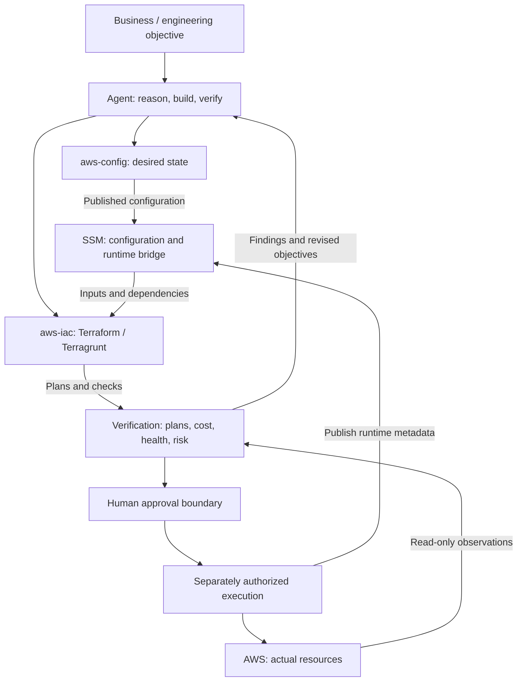

# Adage

**Configuration-driven AWS infrastructure evolving into an agent-ready engineering control plane.**

Adage separates desired infrastructure state from reusable Terraform implementation and runtime metadata. It was designed around explicit configuration, composable components, dynamic dependency resolution, and controlled deployment. Those same properties make it well suited to autonomous engineering agents: agents can understand infrastructure, develop changes, verify them deterministically, and produce cost and risk evidence while consequential AWS execution remains under explicit human control.

**Status:** The configuration-driven architecture exists. Agent safeguards are implemented in supporting pull requests under review. End-to-end cost reconciliation remains to be proven.

New here? Start with [Getting Started](GETTING_STARTED.md) or the [Serverless Site Quickstart](quickstarts/serverless-site.md). Read [Agent-first evolution](docs/agent-first-evolution.md) for the evolving engineering model.

## Why Adage exists

Cloud infrastructure should be explicit, declarative, decoupled, reusable, and understandable without tribal knowledge. Adage puts intent in configuration, implementation in reusable components, and dependency discovery in AWS Systems Manager Parameter Store (SSM). Explicit environment/account boundaries, Git-controlled changes, and predictable deployment interfaces reduce hidden coupling.

Adage was not originally designed for AI agents. It was designed to make cloud infrastructure explicit, composable, and controllable. Those same properties turned out to be what autonomous engineering agents need to reason safely about infrastructure. The [original design principles](design-principles/README.md) and [May 2025 repository history](https://github.com/usekarma/adage/commit/360597536ec4e283ee1d8f4aa9b0da377409ff49) document the architecture before this agent-first evolution.

## Architecture

The infrastructure paths are established; the agent evidence loop and approval process describe the evolving workflow.

SSM stores `/iac/environment`, `/iac/<component>/<nickname>/config`, and `/iac/<component>/<nickname>/runtime` by convention; `IAC_PREFIX` can change the prefix. SSM bridges configuration and discovery; it does not replace Terraform state or AWS inventory.

## How the repositories fit together

| Part | Responsibility |
| --- | --- |
| **Adage** | Infrastructure control model: intent, reusable implementation, discovery, environments, and controlled deployment. |
| [aws-config](https://github.com/usekarma/aws-config) | Desired state: environment bindings and component instances expected or allowed to exist. Publishes configuration to SSM. |
| [aws-iac](https://github.com/usekarma/aws-iac) | Reusable Terraform/Terragrunt implementation that consumes configuration and publishes runtime metadata. |
| **SSM Parameter Store** | Bridge between configuration, infrastructure deployment, and runtime dependency discovery. |
| [aws-lambda](https://github.com/usekarma/aws-lambda) | Application functions and runtime integration where applicable. |
| **Karma** | Real workload and proving ground for Adage's control model. |
| [agent-business-solution-template](https://github.com/usekarma/agent-business-solution-template) | General methodology: objective → specification → agent work → deterministic verification → evidence → human release decision. Adage realizes these principles for infrastructure. |

## Why this architecture works well with agents

An agent can trace a declared instance to its implementation and dependency metadata, inspect Git history, and prepare bounded changes. Reusable components make new capabilities testable; explicit environments make targets reviewable. Plans and repeatable checks turn reasoning into evidence.

Configuration existence is a deployment prerequisite, **not proof of human approval**. Git review, IAM restrictions, credential separation, and execution gates must enforce authority. Runtime metadata may be stale; live observations remain necessary.

## Agent authority and human approval

> Agents get broad authority in the reasoning and verification space, while humans retain authority over consequential execution.

Agents may inspect repositories/history and AWS read-only; modify code/configuration; build components; run tests, lint, and validation; generate plans; analyze cost and drift; prepare evidence and pull requests; and perform read-only post-change verification.

Explicit human authorization remains required for production apply, destroy, persistent-data deletion (including EBS, snapshots, and databases), sensitive IAM or security-boundary changes, and irreversible operations. Publishing SSM configuration or changing environment bindings also requires authorization because it can affect subsequent deployment.

## Cost and desired-state reconciliation

Cost is a measurable infrastructure objective. The experiment compares **desired state vs. actual AWS state vs. actual cost**, then explains discrepancies.

| Deployment | Exact expected steady-state target |
| --- | ---: |
| strall.com | $0.51/month |
| usekarma.dev | $0.61/month |
| **Combined** | **$1.12/month** |

These are owner-specified targets, not verified current bills or guaranteed AWS pricing. Billing period, usage assumptions, shared charges, and attribution must be established by evidence.

> Explain every cent of AWS spend above the expected $1.12/month steady-state target, identify its infrastructure cause, map it back to desired state/IaC where possible, and produce a safe remediation plan without performing destructive changes.

## Karma as the proving ground

Karma provides a concrete system for testing whether Adage can explain real resources, dependencies, drift, and spend. The two deployment targets make the experiment measurable. A successful result needs a traceable cost ledger, scoped inventory, reviewed remediation proposals, and explicit uncertainty. [Proof requirements](docs/agent-first-evolution.md#first-cost-proof) define the next experiment.

## Current validation and proof status

| Category | Evidence / status |
| --- | --- |
| Existing architecture | [Design principles](design-principles/README.md), [deployment documentation](deployment/README.md), and supporting config/IaC repositories. These describe the model; they do not certify every component. |
| Agent work implemented, under review | [aws-iac PR #1](https://github.com/usekarma/aws-iac/pull/1) and [aws-config PR #1](https://github.com/usekarma/aws-config/pull/1): verification gates, target preflight, mutation guards, planning, and evidence workflow. These are not yet default-branch capabilities. |
| General engineering methodology | [Template v2](https://github.com/usekarma/agent-business-solution-template): executable specs, quality gates, and readiness evidence. Passing template checks does not establish infrastructure readiness. |
| Still being validated | Complete account/region inventory, resource-level billing attribution, target assumptions, and safe remediation plans. No complete public end-to-end cost proof is linked here yet. |
| Future direction | Repeatable reconciliation, broader component coverage, and measured savings after separately authorized execution. |

## Getting started

1. Follow [Getting Started](GETTING_STARTED.md) for AWS access and tooling, then [Validate Your Setup](validate_setup.md).
2. Customize `aws-config` for your environments and select reusable components from `aws-iac`.
3. Follow the [Serverless Site](quickstarts/serverless-site.md) or [Serverless API](quickstarts/serverless-api.md) quickstart and [deployment flow](deployment/README.md).
4. For agent work, use the [evolving workflow and limitations](docs/agent-first-evolution.md). Read the target branch's instructions before running commands: deployment scripts can mutate AWS.

## Deeper documentation

- [Design principles](design-principles/README.md) and [original system diagram](img/adage-system-diagram.png)
- [Agent-first evolution and cost proof](docs/agent-first-evolution.md)
- [Deployment strategies](deployment/README.md) and [adaptive runtime concepts](data-science/README.md)
- [Account bootstrap](bootstrap-checklist.md), [organization structure](org-structure/README.md), and [login strategy](aws-login-strategy.md)
- [Security baseline](security-baseline/README.md), [cross-account access](cross-account-access/README.md), [tagging](tagging-policy/README.md), and [cost management](cost-management/README.md)
- [Troubleshooting](troubleshooting_common_issues.md)
